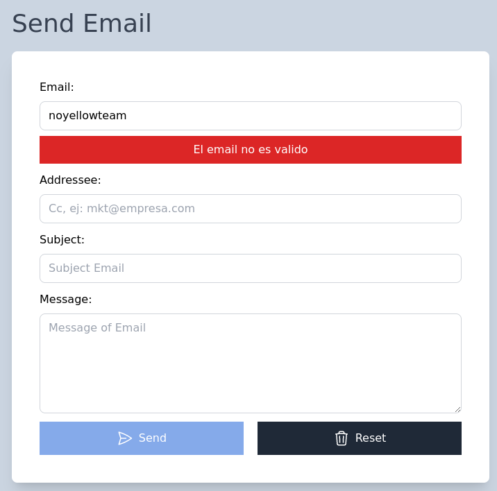
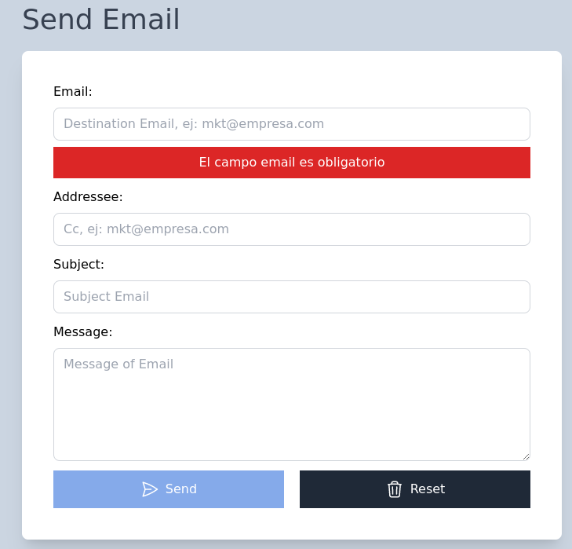
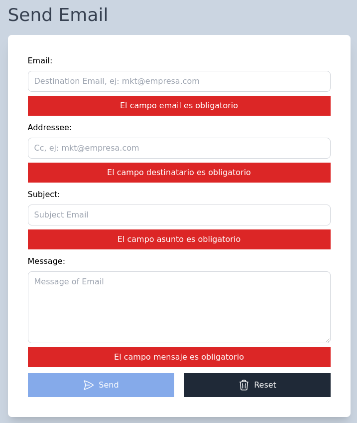
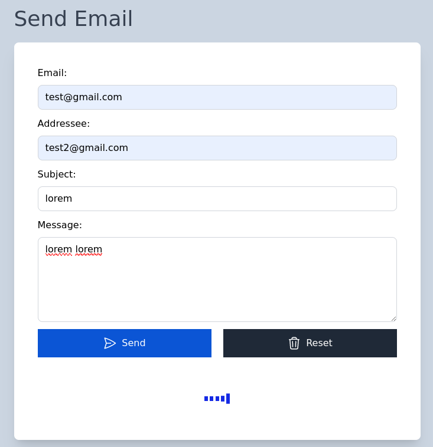
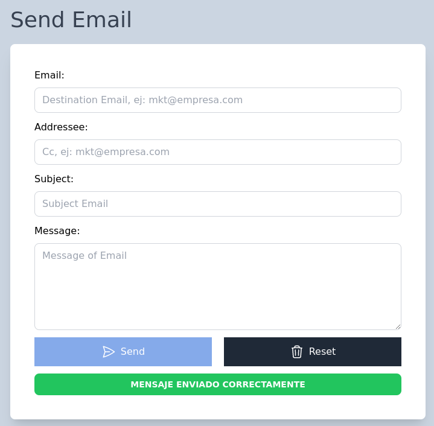
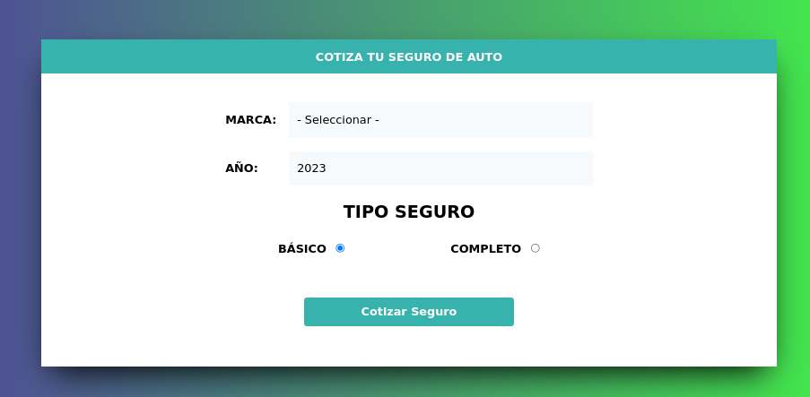
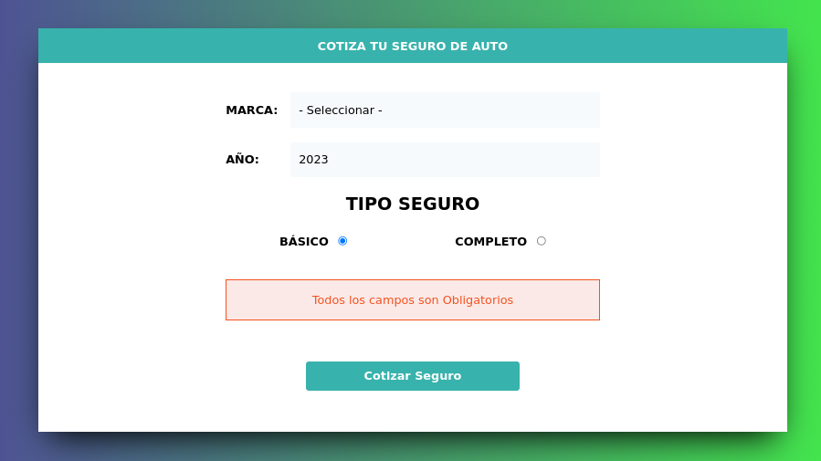
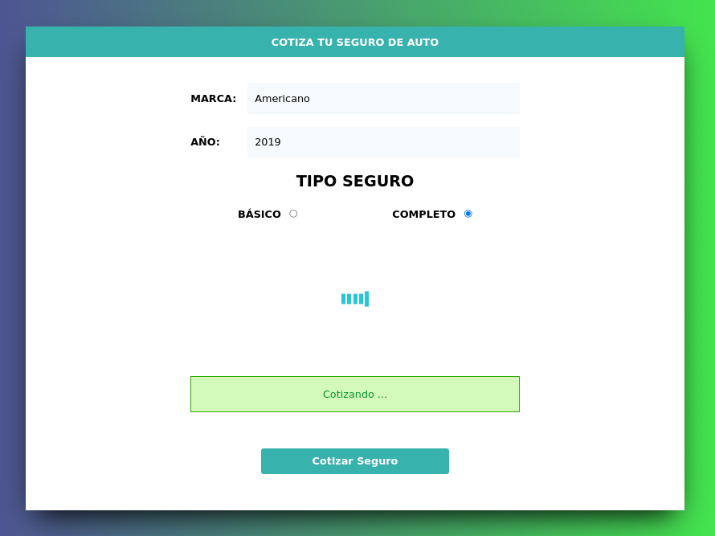
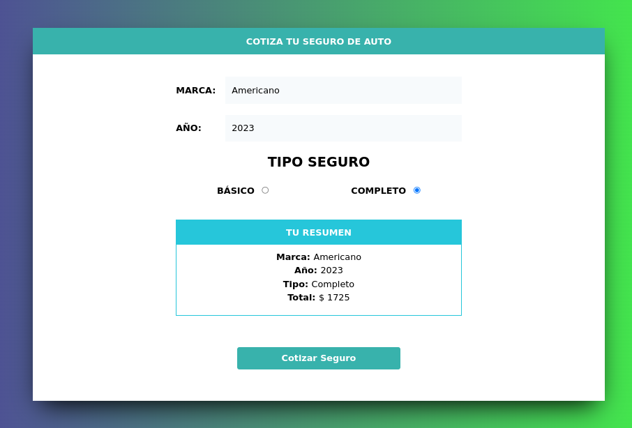

# JavaScript Portfolio

# Table of contents

- [Shopping Cart](#shopping-cart)
- [Sent email validation](#sent-email-validation)
    - Home Screen
    - Validation email field
    - Some empty field
    - All field complete
    - Alert sent email
- [Car finder](#car-finder)
- [Notes with LocalStorage](#notes-with-localstorage)
- [Shopping Cart with LocalStorage](#shopping-cart-with-localstorage)
- [Insurance quoter](#insurance-quoter)
    - Home Screen
    - Show error alert
    - Show correct alert
    - Show resume

# Shopping Cart
[(Back to top)](#table-of-contents)

# Sent email validation
[(Back to top)](#table-of-contents)

The following project simulates the process of submitting a form and aims to validate fields **Email**, **Addressee**, **Subject** and **Message** so that the submit button is finally enabled.

- Home Screen

  

- Validation email field : requerid and valid email

      

- Some empty field

  

- All field complete: enabled send button

  

- Alert sent email

  

# Car finder
[(Back to top)](#table-of-contents)

# Notes with LocalStorage
[(Back to top)](#table-of-contents)

# Shopping Cart with LocalStorage
[(Back to top)](#table-of-contents)

# Insurance quoter
[(Back to top)](#table-of-contents)

The following project aims show a resume of Insurance Quoter, previous that, the fields **Mark**, **year** and **insurance type** would be with a valor to show the resume, otherwise show a error alert.

- Home Screen

  

- Show error alert

  

- Show correct alert

  

- Show resume

  

