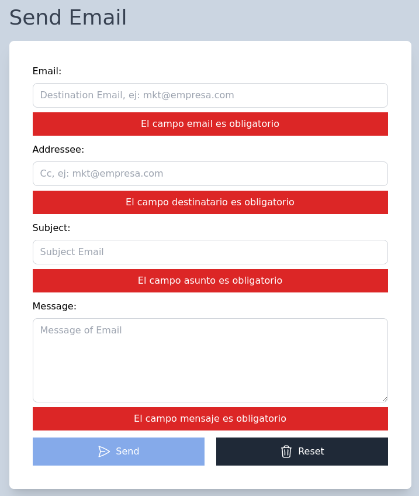
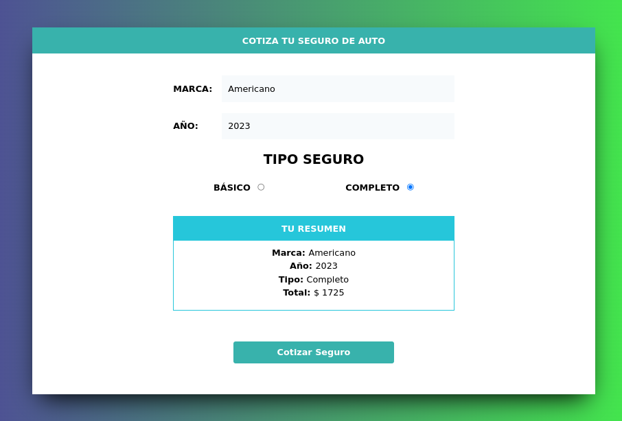
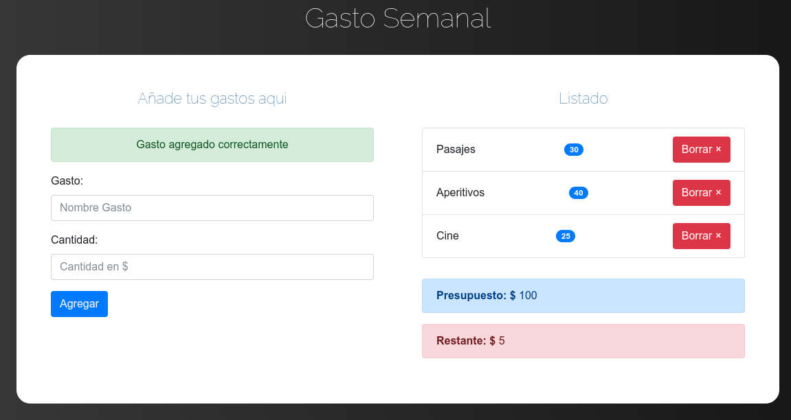

# JavaScript Portfolio

# Table of contents

- [Shopping Cart](#shopping-cart)
- [Sent email validation](#sent-email-validation)
- [Car finder](#car-finder)
- [Notes with LocalStorage](#notes-with-localstorage)
- [Shopping Cart with LocalStorage](#shopping-cart-with-localstorage)
- [Insurance quoter](#insurance-quoter)
- [Self Manage Budgets](#self-manage-budgets)

# Shopping Cart
[(Back to top)](#table-of-contents)

# Sent email validation
[(Back to top)](#table-of-contents)

The following project simulates the process of submitting a form and aims to validate fields **Email**, **Addressee**, **Subject** and **Message** so that the submit button is finally enabled.

- [Link Sent Email Validation](https://email-validation-js.netlify.app/)
- Some empty field

  

# Insurance quoter
[(Back to top)](#table-of-contents)

The following project aims show a resume of Insurance Quoter, previous that, the fields **Mark**, **year** and **insurance type** would be with a valor to show the resume, otherwise show a error alert.

- [Link Insurance quoter](https://cotizador-seguros-aqp.netlify.app/)
- Show resume

  

# Self Manage Budgets
[(Back to top)](#table-of-contents)

The following project aims manage your budget, such as: entertainment, tickets, meal, shopping and amoung others, First you put your Budget and then you can list until the budget is finished, you can delete and add more items.

- [Link Self Manage Budget](https://gestiona-presupuesto.netlify.app/)
- Home Screen

  

