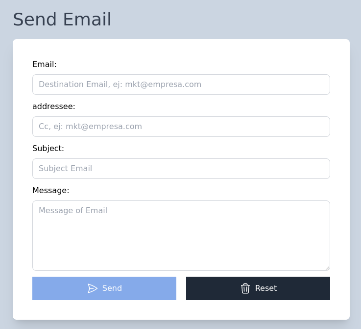

# JavaScript Portfolio

# Table of contents

- [JavaScript Portfolio](#javascript-portfolio)
- [Table of contents](#table-of-contents)
- [Shopping Cart](#shopping-cart)
- [Sent email validation](#sent-email-validation)
- [Car finder](#car-finder)
- [Notes with LocalStorage](#notes-with-localstorage)
- [Shopping Cart with LocalStorage](#shopping-cart-with-localstorage)
- [Insurance quoter](#insurance-quoter)

# Shopping Cart
[(Back to top)](#table-of-contents)

# Sent email validation
[(Back to top)](#table-of-contents)

The following project simulates the process of submitting a form and aims to validate fields **Email**, **Addressee**, **Subject** and **Message** so that the submit button is finally enabled.

- Home Screen

  

# Car finder
[(Back to top)](#table-of-contents)

# Notes with LocalStorage
[(Back to top)](#table-of-contents)

# Shopping Cart with LocalStorage
[(Back to top)](#table-of-contents)

# Insurance quoter
[(Back to top)](#table-of-contents)